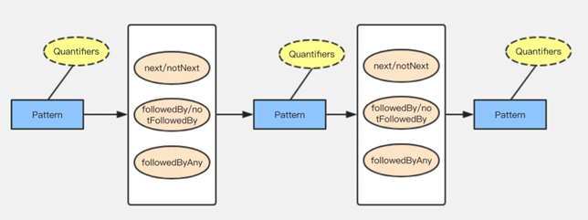
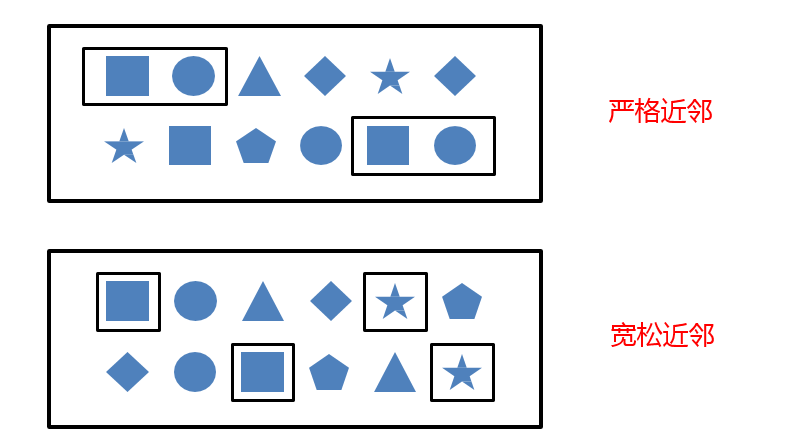
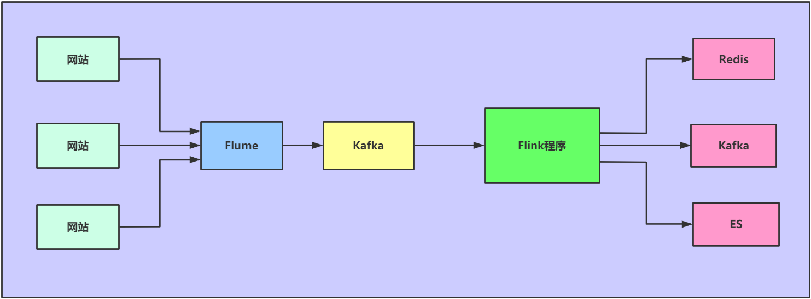
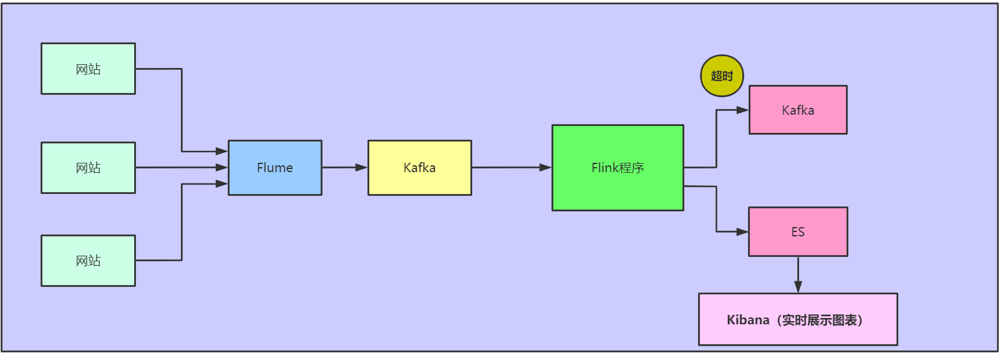
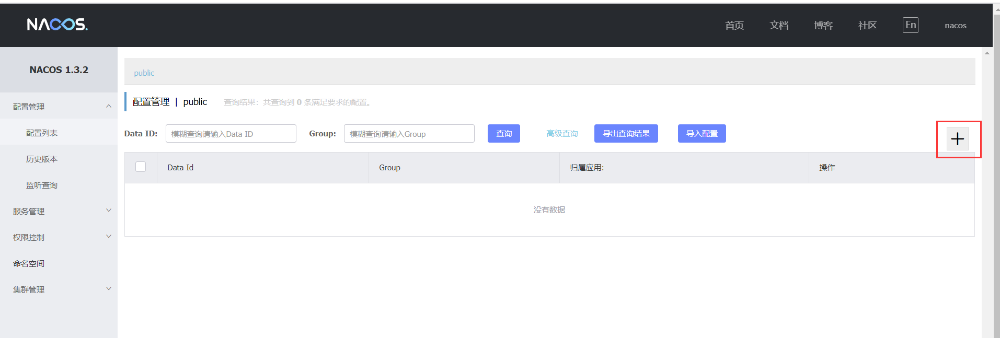
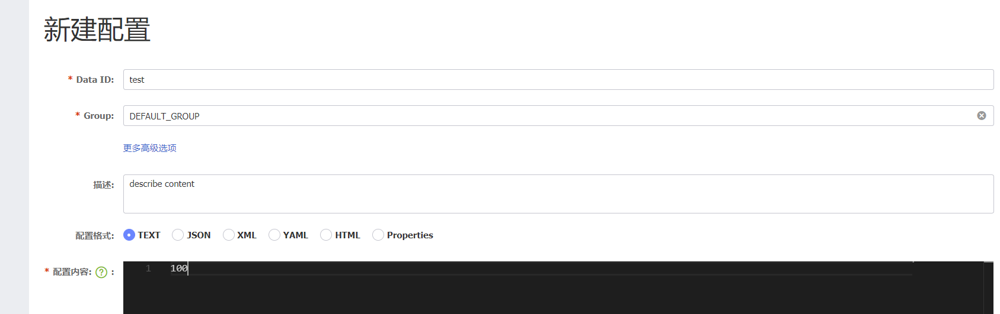

# Flink当中的复杂事件检测机制CEP

# 1. Flink的复杂事件处理机制CEP

## 1.1 CEP概念

~~~
	CEP是Complex Event Processing三个单词的缩写，表示复杂事件处理，是一种基于流处理的技术，CEP是Flink专门为我们提供的一个基于复杂事件监测处理的库，CEP通过一个或多个由简单事件构成的事件流通过一定的规则匹配，然后输出用户想得到的数据，满足规则的复杂事件。
	
	CEP复杂事件处理主要应用于防范网络欺诈、设备故障检测、风险规避和智能营销等领域。Flink 基于 DataStrem API 提供了 FlinkCEP 组件栈，专门用于对复杂事件的处理，帮助用户从流式数据中发掘有价值的信息。
~~~

* 例如下图，我们就可以通过CEP实现我们对复杂事件的匹配处理



## 1.2 CEP的主要特点

* 目标：从有序的简单事件流中发现一些高阶特征

  * 输入：一个或多个由简单事件构成的事件流
  * 处理：识别简单事件之间的内在联系，多个符合一定规则的简单事件构成复杂事件
  * 输出：满足规则的复杂事件

  


## 1.3 Pattern API

* FlinkCEP 中提供了 Pattern API 用于对输入流数据的复杂事件规则定义，并从事件流中抽取事件结果。
* 包含四个步骤
  * （1）输入事件流的创建 
  * （2）Pattern 的定义
  * （3）Pattern 应用在事件流上检测
  * （4）选取结果

### 1.3.1 输入事件流的创建

~~~scala
//获取数据输入流
val input: DataStream[Event] = ...
~~~

### 1.3.2 Pattern的定义

* 定义 Pattern 可以是单次执行模式，也可以是循环执行模式。单次执行模式一次只接受 一个事件，循环执行模式可以接收一个或者多个事件。通常情况下，可以通过指定循环次数将单次执行模式变为循环执行模式。每种模式能够将多个条件组合应用到同一事件之上，条件组合可以通过 where 方法进行叠加。

* 每个 Pattern 都是通过 begin 方法定义的

  ~~~scala
  val start = Pattern.begin[Event]("start_pattern")
  ~~~

* 下一步通过 Pattern.where()方法在 Pattern 上指定 Condition，只有当 Condition 满足之后，当前的 Pattern 才会接受事件

  ~~~scala
  start.where(_.getID == "9527")
  ~~~

* ==1、设置循环次数==

  * 对于已经创建好的 Pattern，可以指定循环次数，形成循环执行的 Pattern

    * times：可以通过 times 指定固定的循环执行次数

      ~~~scala
      //指定循环触发4次 
      start.times(4); 
      //可以执行触发次数范围,让循环执行次数在该范围之内 
      start.times(2, 4);
      ~~~

    * optional：也可以通过 optional 关键字指定要么不触发，要么触发指定的次数

      ~~~scala
      start.times(4).optional()
      start.times(2, 4).optional()
      ~~~

    * greedy：可以通过 greedy 将 Pattern 标记为贪婪模式，在 Pattern 匹配成功的前提下，会尽可能多次触发。

      ~~~scala
      //触发2、3、4次,尽可能重复执行 
      start.times(2, 4).greedy()
      //触发0、2、3、4次,尽可能重复执行 
      start.times(2, 4).optional().greedy()
      ~~~

    * oneOrMore：可以通过 oneOrMore 方法指定触发一次或多次

      ~~~scala
      // 触发一次或者多次 
      start.oneOrMore()
      //触发一次或者多次,尽可能重复执行 
      start.oneOrMore().greedy() 
      // 触发0次或者多次 
      start.oneOrMore().optional() 
      // 触发0次或者多次,尽可能重复执行 
      start.oneOrMore().optional().greedy()
      ~~~

    * timesOrMor：通过 timesOrMore 方法可以指定触发固定次数以上，例如执行两次以上

      ~~~scala
      // 触发两次或者多次 
      start.timesOrMore(2);
      // 触发两次或者多次,尽可能重复执行 
      start.timesOrMore(2).greedy()
      // 不触发或者触发两次以上,尽可能重执行 
      start.timesOrMore(2).optional().greedy()
      ~~~

* ==2、定义条件==

  * 每个模式都需要指定触发条件，作为事件进入到该模式是否接受的判断依据，当事件中的数值满足了条件时，便进行下一步操作。在 FlinkCFP 中通过 pattern.where()、 pattern.or()及pattern.until()方法来为 Pattern 指定条件，且 Pattern 条件有 Simple Conditions 及Combining Conditions 等类型

    * Simple Conditions（简单条件）

      * 其主要根据事件中的字段信息进行判断，决定是否接受该事件。 

        ~~~scala
        // 把ID为9527的事件挑选出来
        start.where(_.getID == "9527")
        ~~~

    * Combining Conditions（组合条件）

      * 是将简单条件进行合并，通常情况下也可以使用 where 方法进行条件的组合，默认每个条件通过 AND 逻辑相连。如果需要使用 OR 逻辑，直接使用 or 方法连接条件即可

        ~~~scala
        // 把ID为9527或者年龄大于30的事件挑选出来 
        val start = Pattern.begin[Event]("start_pattern")
        				 .where(_.callType=="success").or(_.age >30)
        ~~~

    * Stop condition （终止条件）

      * 如果程序中使用了 oneOrMore 或者 oneOrMore().optional()方法，还可以指定停止条件，否则模式中的规则会一直循环下去，如下终止条件通过 until()方法指定

        ~~~scala
        start.oneOrMore.until(_.getID == "123")
        ~~~

* ==3、模式序列==

  * 将相互独立的模式进行组合然后形成模式序列。模式序列基本的编写方式和独立模式一 致，各个模式之间通过邻近条件进行连接即可，其中有严格邻近、宽松邻近、非确定宽松邻近三种邻近连接条件。

    * 严格邻近

      * 严格邻近条件中，需要所有的事件都按照顺序满足模式条件，不允许忽略任意不满足的模式

        * next

        ~~~scala
        //示例
        begin("first").where(_.name='a').next("second").where(.name='b')
        //当且仅当数据为a,b时，模式才会被命中。如果数据为a,c,b，由于a的后面跟了c，所以a会被直接丢弃，模式不会命中。
        ~~~

    * 宽松邻近

      * 在宽松邻近条件下，会忽略没有成功匹配模式条件，并不会像严格邻近要求得那么高，可以简单理解为 OR 的逻辑关系

        * followedBy

        ~~~scala
        //示例
        begin("first").where(_.name='a').followedBy("second").where(.name='b')
        //当且仅当数据为a,b或者为a,c,b，，模式均被命中，中间的c会被忽略掉。
        ~~~

    * 非确定宽松邻近

      * 和宽松邻近条件相比，非确定宽松邻近条件指在模式匹配过程中可以忽略已经匹配的条件

        * followedByAny

        ~~~scala
        //示例
        begin("first").where(_.name='a').followedByAny("second").where(.name='b')
        //当且仅当数据为a,c,b,b时，对于followedBy模式而言命中的为{a,b}，
        //对于followedByAny而言会有两次命中{a,b},{a,b}
        ~~~

      

    * 除以上模式序列外，还可以定义“不希望出现某种近邻关系”

      * notNext() 
        * 不想让某个事件严格紧邻前一个事件发生 
      * notFollowedBy() 
        * 不想让某个事件在两个事件之间发生

  * 注意

    * 1、所有模式序列必须以 .begin() 开始 

    * 2、模式序列不能以 .notFollowedBy() 结束 

    * 3、“not” 类型的模式不能和optional关键字同时使用 

    * 4、此外，还可以为模式指定时间约束，用来要求在多长时间内匹配有效 

      ~~~scala
      //指定模式在10秒内有效 
      pattern.within(Time.seconds(10))
      ~~~


### 1.3.3 Pattern检测

* 调用CEP.pattern()方法，给定输入流和模式，就能得到一个PatternStream

  ~~~scala
  //Pattern检测
  val patternStream = CEP.pattern[Event](dataStream,pattern)
  ~~~


### 1.3.4 选取结果

* 得到 PatternStream 类型的数据集后，接下来数据获取都基于 PatternStream 进行。该数据集中包含了所有的匹配事件。目前在 FlinkCEP 中提供 select 和 flatSelect 两种方法从 PatternStream 提取事件结果。

* 1、通过 Select Funciton 抽取正常事件

  * 可以通过在 PatternStream 的 Select 方法中传入自定义 Select Funciton 完成对匹配 事件的转换与输出。其中 Select Funciton 的输入参数为 Map[String, Iterable[IN]]，Map 中的 key 为模式序列中的 Pattern 名称，Value 为对应 Pattern 所接受的事件集合，格式为输入事件的数据类型。

    ~~~scala
    def selectFunction(pattern : Map[String, Iterable[IN]]): OUT = {
        //获取pattern中的start
         Event val startEvent = pattern.get("start_pattern").get.next
        //获取Pattern中middle
        Event val middleEvent = pattern.get("middle").get.next 
        //返回结果 
        OUT(startEvent, middleEvent)
    
    }
    ~~~


* 2、通过 Flat Select Funciton 抽取正常事件

  * Flat Select Funciton 和 Select Function 相似，不过 Flat Select Funciton 在每次调用可以返回任意数量的结果。因为 Flat Select Funciton 使用 Collector 作为返回结果的容器，可以将需要输出的事件都放置在 Collector 中返回。 

    ~~~scala
    def flatSelectFunction(pattern : Map[String, Iterable[IN]]),collector:Collector[OUT] = {
        //获取pattern中的start
         Event val startEvent = pattern.get("start_pattern").get.next
        //获取Pattern中middle
        Event val middleEvent = pattern.get("middle").get.next 
        //并根据startEvent的Value数量进行返回
        for (i <- 0 to startEvent.getValue) { 
            collector.collect(OUT(startEvent, middleEvent)) }
    	}
    }
    ~~~

* 3、通过 Select Funciton 抽取超时事件

  * 如果模式中有 within(time)，那么就很有可能有超时的数据存在，通过 PatternStream，Select 方法分别获取超时事件和正常事件。首先需要创建 OutputTag 来标记超时事件，然后在 PatternStream.select 方法中使用 OutputTag，就可以将超时事件从 PatternStream中抽取出来。 

    ~~~scala
    // 通过CEP.pattern方法创建PatternStream 
    val patternStream: PatternStream[Event] = CEP.pattern(input, pattern) 
    
    //创建OutputTag,并命名为timeout-output 
    val timeoutTag = OutputTag[String]("timeout-output") 
    
    //调用PatternStream select()并指定timeoutTag 
    val result: SingleOutputStreamOperator[NormalEvent] = patternStream.select(timeoutTag){ 
    //超时事件获取 
    (pattern: Map[String, Iterable[Event]], timestamp: Long) =>
    	TimeoutEvent() //返回异常事件
     } 
     { 
     //正常事件获取 
     pattern: Map[String, Iterable[Event]] =>
     	NormalEvent()//返回正常事件 
     } 
     //调用getSideOutput方法,并指定timeoutTag将超时事件输出 
     val timeoutResult: DataStream[TimeoutEvent] = result.getSideOutput(timeoutTag)
    ~~~


# 2. CEP编程开发案例实战1

* 描述

  * 在我们操作某些银行APP的时候，经常会发现，如果上一个操作与下一个操作IP变换了（例如上一个操作使用的流量操作，下一个操作我连接上了wifi去操作，IP就会变换），那么APP就要求我们重新进行登录，避免由于IP变换产生的风险操作

* 需求

  - 用户上一个操作与下一个操作IP变换报警

* 数据格式如下

  * 从socket当中输入数据源

  ~~~
  192.168.52.100,zhubajie,https://icbc.com.cn/login.html,2020-02-12 12:23:45
  192.168.54.172,tangseng,https://icbc.com.cn/login.html,2020-02-12 12:23:46
  192.168.145.77,sunwukong,https://icbc.com.cn/login.html,2020-02-12 12:23:47
  192.168.52.100,zhubajie,https://icbc.com.cn/transfer.html,2020-02-12 12:23:47
  192.168.54.172,tangseng,https://icbc.com.cn/transfer.html,2020-02-12 12:23:48
  192.168.145.77,sunwukong,https://icbc.com.cn/transfer.html,2020-02-12 12:23:49
  192.168.145.77,sunwukong,https://icbc.com.cn/save.html,2020-02-12 12:23:52
  192.168.52.100,zhubajie,https://icbc.com.cn/save.html,2020-02-12 12:23:53
  192.168.54.172,tangseng,https://icbc.com.cn/save.html,2020-02-12 12:23:54
  192.168.54.172,tangseng,https://icbc.com.cn/buy.html,2020-02-12 12:23:57
  192.168.145.77,sunwukong,https://icbc.com.cn/buy.html,2020-02-12 12:23:58
  192.168.52.100,zhubajie,https://icbc.com.cn/buy.html,2020-02-12 12:23:59
  192.168.44.110,zhubajie,https://icbc.com.cn/pay.html,2020-02-12 12:24:03
  192.168.38.135,tangseng,https://icbc.com.cn/pay.html,2020-02-12 12:24:04
  192.168.89.189,sunwukong,https://icbc.com.cn/pay.html,2020-02-12 12:24:05
  192.168.44.110,zhubajie,https://icbc.com.cn/login.html,2020-02-12 12:24:04
  192.168.38.135,tangseng,https://icbc.com.cn/login.html,2020-02-12 12:24:08
  192.168.89.189,sunwukong,https://icbc.com.cn/login.html,2020-02-12 12:24:07
  192.168.38.135,tangseng,https://icbc.com.cn/pay.html,2020-02-12 12:24:10
  192.168.44.110,zhubajie,https://icbc.com.cn/pay.html,2020-02-12 12:24:06
  192.168.89.189,sunwukong,https://icbc.com.cn/pay.html,2020-02-12 12:24:09
  192.168.38.135,tangseng,https://icbc.com.cn/pay.html,2020-02-12 12:24:13
  192.168.44.110,zhubajie,https://icbc.com.cn/pay.html,2020-02-12 12:24:12
  192.168.89.189,sunwukong,https://icbc.com.cn/pay.html,2020-02-12 12:24:15
  ~~~

  * 整理之后的格式如下：

  ~~~
  192.168.145.77,sunwukong,https://icbc.com.cn/login.html,2020-02-12 12:23:47
  192.168.145.77,sunwukong,https://icbc.com.cn/transfer.html,2020-02-12 12:23:49
  192.168.145.77,sunwukong,https://icbc.com.cn/save.html,2020-02-12 12:23:52
  192.168.145.77,sunwukong,https://icbc.com.cn/buy.html,2020-02-12 12:23:58
  192.168.89.189,sunwukong,https://icbc.com.cn/pay.html,2020-02-12 12:24:05
  192.168.89.189,sunwukong,https://icbc.com.cn/login.html,2020-02-12 12:24:07
  192.168.89.189,sunwukong,https://icbc.com.cn/pay.html,2020-02-12 12:24:09
  192.168.89.189,sunwukong,https://icbc.com.cn/pay.html,2020-02-12 12:24:15
  
  192.168.52.100,zhubajie,https://icbc.com.cn/login.html,2020-02-12 12:23:45
  192.168.52.100,zhubajie,https://icbc.com.cn/transfer.html,2020-02-12 12:23:47
  192.168.52.100,zhubajie,https://icbc.com.cn/save.html,2020-02-12 12:23:53
  192.168.52.100,zhubajie,https://icbc.com.cn/buy.html,2020-02-12 12:23:59
  192.168.44.110,zhubajie,https://icbc.com.cn/pay.html,2020-02-12 12:24:03
  192.168.44.110,zhubajie,https://icbc.com.cn/login.html,2020-02-12 12:24:04
  192.168.44.110,zhubajie,https://icbc.com.cn/pay.html,2020-02-12 12:24:06
  192.168.44.110,zhubajie,https://icbc.com.cn/pay.html,2020-02-12 12:24:12
  
  192.168.54.172,tangseng,https://icbc.com.cn/login.html,2020-02-12 12:23:46
  192.168.54.172,tangseng,https://icbc.com.cn/transfer.html,2020-02-12 12:23:48
  192.168.54.172,tangseng,https://icbc.com.cn/save.html,2020-02-12 12:23:54
  192.168.54.172,tangseng,https://icbc.com.cn/buy.html,2020-02-12 12:23:57
  192.168.38.135,tangseng,https://icbc.com.cn/pay.html,2020-02-12 12:24:04
  192.168.38.135,tangseng,https://icbc.com.cn/login.html,2020-02-12 12:24:08
  192.168.38.135,tangseng,https://icbc.com.cn/pay.html,2020-02-12 12:24:10
  192.168.38.135,tangseng,https://icbc.com.cn/pay.html,2020-02-12 12:24:13
  ~~~


## 2.1 使用State编程实现

* 代码开发

  ~~~scala
  package com.kaikeba.cep
  
  import java.util
  import java.util.Collections
  
  import org.apache.flink.api.common.state.{ListState, ListStateDescriptor}
  import org.apache.flink.configuration.Configuration
  import org.apache.flink.streaming.api.functions.KeyedProcessFunction
  import org.apache.flink.streaming.api.scala.{DataStream, StreamExecutionEnvironment}
  import org.apache.flink.util.Collector
  
  /**
    * 使用state编程进行代码实现进行ip检测
    */
  
  case class UserLogin(ip:String,username:String,operateUrl:String,time:String)
  
  object CheckIPChangeWithState {
  
    def main(args: Array[String]): Unit = {
        
      val environment: StreamExecutionEnvironment = StreamExecutionEnvironment.getExecutionEnvironment
      import org.apache.flink.api.scala._
  
      //todo:1、接受socket数据源
      val sourceStream: DataStream[String] = environment.socketTextStream("node01",9999)
  
      //todo:2、数据处理
      sourceStream.map(x =>{
        val strings: Array[String] = x.split(",")
        (strings(1),UserLogin(strings(0),strings(1),strings(2),strings(3)))
      } ).keyBy(x => x._1)
        .process(new LoginCheckProcessFunction)
        .print()
      environment.execute("checkIpChange")
  
  
    }
  }
  //自定义KeyedProcessFunction类
  class LoginCheckProcessFunction extends KeyedProcessFunction[String,(String,UserLogin),(String,UserLogin)]{
  
     //定义ListState
     var listState:ListState[UserLogin]=_
  
    override def open(parameters: Configuration): Unit = {
      listState = getRuntimeContext.getListState(new ListStateDescriptor[UserLogin]("changeIp",classOf[UserLogin]))
  
    }
  
    //解析用户访问信息
    override def processElement(value: (String, UserLogin), ctx: KeyedProcessFunction[String, (String, UserLogin), (String, UserLogin)]#Context, out: Collector[(String, UserLogin)]): Unit = {
      val logins = new util.ArrayList[UserLogin]()
  
      //添加到list集合
       listState.add(value._2)
  
      import scala.collection.JavaConverters._
      val toList: List[UserLogin] = listState.get().asScala.toList
       //排序
      val sortList: List[UserLogin] = toList.sortBy(_.time)
  
      if(sortList.size ==2){
        val first: UserLogin = sortList(0)
        val second: UserLogin = sortList(1)
  
        if(!first.ip.equals(second.ip)){
          println("小伙子你的IP变了，赶紧回去重新登录一下")
        }
        //移除第一个ip，保留第二个ip
        logins.removeAll(Collections.EMPTY_LIST)
        logins.add(second)
        listState.update(logins)
      }
  
       out.collect(value)
  
    }
  
  }
  
  ~~~


## 2.2 使用CEP编程实现

* 导入cep依赖

  ~~~xml
  <dependency>
      <groupId>org.apache.flink</groupId>
      <artifactId>flink-cep-scala_2.11</artifactId>
      <version>1.9.2</version>
  </dependency>
  ~~~

* 代码开发

  ~~~scala
  package com.kaikeba.cep
  
  import java.util
  
  import org.apache.flink.cep.PatternSelectFunction
  import org.apache.flink.cep.pattern.conditions.IterativeCondition
  import org.apache.flink.cep.scala.{CEP, PatternStream}
  import org.apache.flink.cep.scala.pattern.Pattern
  import org.apache.flink.streaming.api.scala.{DataStream, KeyedStream, StreamExecutionEnvironment}
  import org.apache.flink.streaming.api.windowing.time.Time
  
  import scala.collection.mutable
  
  /**
    *使用 CEP 编程进行代码实现进行ip检测
    */
  
  case class UserLoginInfo(ip:String,username:String,operateUrl:String,time:String)
  object CheckIPChangeWithCEP {
  
    def main(args: Array[String]): Unit = {
      val environment: StreamExecutionEnvironment = StreamExecutionEnvironment.getExecutionEnvironment
      import org.apache.flink.api.scala._
  
      //todo:1、接受socket数据源
      val sourceStream: DataStream[String] = environment.socketTextStream("node01",9999)
  
      //todo:2、数据处理
      val keyedStream: KeyedStream[(String, UserLoginInfo), String] = sourceStream.map(x => {
                         val strings: Array[String] = x.split(",")
                        (strings(1), UserLoginInfo(strings(0), strings(1), strings(2), strings(3)))
              }).keyBy(_._1)
  
  
     //todo:3、定义Pattern,指定相关条件和模型序列
      val pattern: Pattern[(String, UserLoginInfo), (String, UserLoginInfo)] = Pattern.begin[(String, UserLoginInfo)]("start")
            .where(x => x._2.username != null)
            .next("second")
            .where(new IterativeCondition[(String, UserLoginInfo)] {
              override def filter(value: (String, UserLoginInfo), context: IterativeCondition.Context[(String, UserLoginInfo)]): Boolean = {
                var flag: Boolean = false
                //获取满足前面条件的数据
                val firstValues: util.Iterator[(String, UserLoginInfo)] = context.getEventsForPattern("start").iterator()
                //遍历
                while (firstValues.hasNext) {
                  val tuple: (String, UserLoginInfo) = firstValues.next()
                  //ip不相同
                  if (!tuple._2.ip.equals(value._2.ip)) {
                    flag = true
                  }
                }
  
                flag
              }
            })
          //可以指定模式在一段时间内有效
        .within(Time.seconds(120))
  
      //todo:4、模式检测，将模式应用到流中
       val patternStream: PatternStream[(String, UserLoginInfo)] = CEP.pattern(keyedStream,pattern)
  
  
      //todo: 5、选取结果
       patternStream.select(new MyPatternSelectFunction).print()
  
  
      //todo: 6、开启计算
      environment.execute()
  
    }
  
  }
  
  //自定义PatternSelectFunction类
  class MyPatternSelectFunction extends PatternSelectFunction[(String,UserLoginInfo),(String,UserLoginInfo)]{
    override def select(map: util.Map[String, util.List[(String, UserLoginInfo)]]): (String, UserLoginInfo) = {
          // 获取Pattern名称为start的事件
           val startIterator= map.get("start").iterator()
  
           if(startIterator.hasNext){
              println("满足start模式中的数据："+startIterator.next())
           }
  
  
          //获取Pattern名称为second的事件
           val secondIterator = map.get("second").iterator()
  
  
          var tuple:(String,UserLoginInfo)=null
  
          if(secondIterator.hasNext){
              tuple=secondIterator.next()
              println("满足second模式中的数据："+ tuple)
          }
  
      tuple
    }
  }
  
  
  ~~~


#  3. Flink CEP综合案例实战2

* 场景介绍

  * 现在工厂当中有大量的传感设备，用于检测机器当中的各种指标数据，例如温度，湿度，气压等，并实时上报数据到数据中心，现在需要检测，某一个传感器上报的温度数据是否发生异常。

* 异常的定义

  * 三分钟时间内，出现三次及以上的温度高于40度就算作是异常温度，进行报警输出

* 收集数据如下：

  ~~~
  传感器设备mac地址，检测机器mac地址，温度，湿度，气压，数据产生时间
  
  00-34-5E-5F-89-A4,00-01-6C-06-A6-29,38,0.52,1.1,2020-03-02 12:20:32
  00-34-5E-5F-89-A4,00-01-6C-06-A6-29,47,0.48,1.1,2020-03-02 12:20:35
  00-34-5E-5F-89-A4,00-01-6C-06-A6-29,50,0.48,1.1,2020-03-02 12:20:38
  00-34-5E-5F-89-A4,00-01-6C-06-A6-29,48,0.48,1.1,2020-03-02 12:20:39
  00-34-5E-5F-89-A4,00-01-6C-06-A6-29,52,0.48,1.1,2020-03-02 12:20:41
  00-34-5E-5F-89-A4,00-01-6C-06-A6-29,53,0.48,1.1,2020-03-02 12:20:43
  00-34-5E-5F-89-A4,00-01-6C-06-A6-29,55,0.48,1.1,2020-03-02 12:20:45
  ~~~


* 代码开发实现：

```scala
package com.kaikeba.cep


import java.util

import org.apache.commons.lang3.time.FastDateFormat
import org.apache.flink.cep.PatternSelectFunction
import org.apache.flink.cep.scala.pattern.Pattern
import org.apache.flink.cep.scala.{CEP, PatternStream}
import org.apache.flink.streaming.api.TimeCharacteristic
import org.apache.flink.streaming.api.scala.{DataStream, KeyedStream, StreamExecutionEnvironment}
import org.apache.flink.streaming.api.windowing.time.Time

//定义温度信息pojo
case class DeviceDetail(sensorMac:String,deviceMac:String,temperature:String,dampness:String,pressure:String,date:String)

//报警的设备信息样例类
//传感器设备mac地址，检测机器mac地址，温度
case class AlarmDevice(sensorMac:String,deviceMac:String,temperature:String)

/**
  * 基于FlinkCEP的设备温度检测
  */
object FlinkTempeatureCEP {

  private val format: FastDateFormat = FastDateFormat.getInstance("yyyy-MM-dd HH:mm:ss")
  def main(args: Array[String]): Unit = {
    val environment: StreamExecutionEnvironment = StreamExecutionEnvironment.getExecutionEnvironment
    //指定时间类型
    environment.setStreamTimeCharacteristic(TimeCharacteristic.EventTime)
    environment.setParallelism(1)
    import org.apache.flink.api.scala._

    //接受数据
    val sourceStream: DataStream[String] = environment.socketTextStream("node01",9999)

    val deviceStream: KeyedStream[DeviceDetail, String] = sourceStream.map(x => {
        val strings: Array[String] = x.split(",")
        DeviceDetail(strings(0), strings(1), strings(2), strings(3), strings(4), strings(5))
    }).assignAscendingTimestamps(x =>{format.parse(x.date).getTime})
      .keyBy(x => x.sensorMac)


     //todo:定义Pattern,指定相关条件和模型序列
    val pattern: Pattern[DeviceDetail, DeviceDetail] = Pattern.begin[DeviceDetail]("start")
                   .where(x =>x.temperature.toInt >= 40)                                               .followedByAny("follow")
                    .where(x =>x.temperature.toInt >= 40)                                             .followedByAny("follow")
                    .where(x =>x.temperature.toInt >= 40)                                             .within(Time.minutes(3))

    //todo:模式检测，将模式应用到流中
    val patternResult: PatternStream[DeviceDetail] = CEP.pattern(deviceStream,pattern)

    //todo:选取结果
    patternResult.select(new MyPatternResultFunction).print()

    //todo: 启动
    environment.execute("startTempeature")

  }
}

//自定义PatternSelectFunction
class MyPatternResultFunction extends PatternSelectFunction[DeviceDetail,AlarmDevice]{
  override def select(pattern: util.Map[String, util.List[DeviceDetail]]): AlarmDevice = {
    val startDetails: util.List[DeviceDetail] = pattern.get("start")
    val followDetails: util.List[DeviceDetail] = pattern.get("follow")
    val thirdDetails: util.List[DeviceDetail] = pattern.get("third")

   val startResult: DeviceDetail = startDetails.iterator().next()
    val followResult: DeviceDetail = followDetails.iterator().next()
    val thirdResult: DeviceDetail = thirdDetails.iterator().next()

    println("第一条数据: "+startResult)
    println("第二条数据: "+followResult)
    println("第三条数据: "+thirdResult)

    AlarmDevice(thirdResult.sensorMac,thirdResult.deviceMac,thirdResult.temperature)
  }
}
```


# 4. Flink CEP综合案例实战3

* 场景介绍

  * 在我们的电商系统当中，经常会发现有些订单下单之后没有支付，就会有一个倒计时的时间值，提示你在15分钟之内完成支付，如果没有完成支付，那么该订单就会被取消，主要是因为拍下订单就会减库存，但是如果一直没有支付，那么就会造成库存没有了，别人购买的时候买不到，然后别人一直不支付，就会产生有些人买不到，有些人买到了不付款，最后导致商家一件产品都卖不出去

* 需求

  * 创建订单之后15分钟之内一定要付款，否则就取消订单

* 订单数据格式如下类型字段说明
  * 订单编号

  * 订单状态

    * 1.创建订单,等待支付
    * 2.支付订单完成
    * 3.取消订单，申请退款
    * 4.已发货 
    * 5.确认收货，已经完成 

  * 订单创建时间

  * 订单金额

    ~~~
    20160728001511050311389390,1,2016-07-28 00:15:11,295
    20160801000227050311955990,1,2016-07-28 00:16:12,165
    20160728001511050311389390,2,2016-07-28 00:18:11,295
    20160801000227050311955990,2,2016-07-28 00:18:12,165
    20160728001511050311389390,3,2016-07-29 08:06:11,295
    20160801000227050311955990,4,2016-07-29 12:21:12,165
    20160804114043050311618457,1,2016-07-30 00:16:15,132
    20160801000227050311955990,5,2016-07-30 18:13:24,165
    ~~~


* 规则，出现 1 创建订单标识之后，紧接着需要在15分钟之内出现 2 支付订单操作，中间允许有其他操作
* 代码开发实现

```scala
package com.kaikeba.cep

import java.util

import org.apache.commons.lang3.time.FastDateFormat
import org.apache.flink.cep.{PatternSelectFunction, PatternTimeoutFunction}
import org.apache.flink.cep.scala.{CEP, PatternStream, pattern}
import org.apache.flink.cep.scala.pattern.Pattern
import org.apache.flink.streaming.api.TimeCharacteristic
import org.apache.flink.streaming.api.functions.timestamps.BoundedOutOfOrdernessTimestampExtractor
import org.apache.flink.streaming.api.scala.{DataStream, KeyedStream, OutputTag, StreamExecutionEnvironment}
import org.apache.flink.streaming.api.windowing.time.Time


/**
  *  订单下单未支付检测
  */

case class OrderDetail(orderId:String,status:String,orderCreateTime:String,price :Double)

object OrderTimeOutCheckCEP {

  private val format: FastDateFormat = FastDateFormat.getInstance("yyy-MM-dd HH:mm:ss")

  def main(args: Array[String]): Unit = {

    val environment: StreamExecutionEnvironment = StreamExecutionEnvironment.getExecutionEnvironment
    environment.setStreamTimeCharacteristic(TimeCharacteristic.EventTime)
    environment.setParallelism(1)
    import org.apache.flink.api.scala._
    val sourceStream: DataStream[String] = environment.socketTextStream("node01",9999)

    val keyedStream: KeyedStream[OrderDetail, String] = sourceStream.map(x => {
      val strings: Array[String] = x.split(",")
      OrderDetail(strings(0), strings(1), strings(2), strings(3).toDouble)

    }).assignTimestampsAndWatermarks(new BoundedOutOfOrdernessTimestampExtractor[OrderDetail](Time.seconds(5)){
      override def extractTimestamp(element: OrderDetail): Long = {
        format.parse(element.orderCreateTime).getTime
      }
    }).keyBy(x => x.orderId)

     //定义Pattern模式，指定条件
    val pattern: Pattern[OrderDetail, OrderDetail] = Pattern.begin[OrderDetail]("start")
                                                            .where(order => order.status.equals("1"))
                                                            .followedBy("second")
                                                            .where(x => x.status.equals("2"))
                                                            .within(Time.minutes(15))


    // 4. 调用select方法，提取事件序列，超时的事件要做报警提示
    val orderTimeoutOutputTag = new OutputTag[OrderDetail]("orderTimeout")

    val patternStream: PatternStream[OrderDetail] = CEP.pattern(keyedStream,pattern)
    val selectResultStream: DataStream[OrderDetail] = patternStream
            .select(orderTimeoutOutputTag, new OrderTimeoutPatternFunction, new OrderPatternFunction)

     selectResultStream.print()

    //打印侧输出流数据 过了15分钟还没支付的数据
    selectResultStream.getSideOutput(orderTimeoutOutputTag).print()
    environment.execute()
  }
}

//订单超时检测
class OrderTimeoutPatternFunction extends PatternTimeoutFunction[OrderDetail,OrderDetail]{

  override def timeout(pattern: util.Map[String, util.List[OrderDetail]], l: Long): OrderDetail = {
    val detail: OrderDetail = pattern.get("start").iterator().next()
        println("超时订单号为" + detail)
        detail
  }
}


class OrderPatternFunction extends PatternSelectFunction[OrderDetail,OrderDetail] {
  override def select(pattern: util.Map[String, util.List[OrderDetail]]): OrderDetail = {
        val detail: OrderDetail = pattern.get("second").iterator().next()
        println("支付成功的订单为" + detail)
        detail
  }
}

```


# 5. 实时ETL

## 5.1 需求背景

* 针对应用产生的日志数据进行清洗拆分

  •1、应用产生的日志数据是嵌套json格式，需要拆分打平

  •2、针对日志数据中的国家字段进行大区转换

  •3、把数据回写到Kafka


## 5.2 数据准备

* reids码表格式(元数据)：
  * 启动redis服务

    ~~~shell
    cd /kkb/install/redis-3.2.8
     src/redis-cli  redis.conf 
    ~~~


* 进入redis客户端

  ~~~
  cd /kkb/install/redis-3.2.8
  src/redis-cli  -h node02
  
  ~~~


* 插入以下数据到redis当中去

  ~~~
  		   大区    国家
  hset areas AREA_US US
  hset areas AREA_CT TW,HK
  hset areas AREA_AR PK,KW,SA
  hset areas AREA_IN IN
  ~~~


* 查询redis当中的数据

  ~~~
   HKEYS areas
   HGETALL areas
  ~~~


* node01执行以下命令，创建kafka的topic

  ~~~
  cd /kkb/install/kafka_2.11-1.1.0
  bin/kafka-topics.sh --create --partitions 3 --topic data1 --replication-factor 2 --zookeeper node01:2181,node02:2181,node03:2181
  ~~~


## 5.3 项目架构




## 5.4 方案实现

* 日志格式：

```java
原始数据结构如下：
第一条数据：
{"dt":"2019-11-19 20:33:41","countryCode":"KW","data":[{"type":"s2","score":0.2,"level":"A"},{"type":"s1","score":0.2,"level":"D"}]}

第二条数据：
{"dt":"2019-11-19 20:33:43","countryCode":"HK","data":[{"type":"s5","score":0.5,"level":"C"},{"type":"s2","score":0.8,"level":"B"}]}

需要我们对数据做ETL处理，将数据拉平

"dt":"2019-11-19 20:33:41","countryCode":"KW","type":"s2","score":0.2,"level":"A"
"dt":"2019-11-19 20:33:41","countryCode":"KW","type":"s1","score":0.2,"level":"D"

让后将countryCode第二步处理，替换成为大区ID

"dt":"2019-11-19 20:33:41","countryCode":"AREA_CT","type":"s2","score":0.2,"level":"A"
"dt":"2019-11-19 20:33:41","countryCode":"AREA_CT","type":"s1","score":0.2,"level":"D"

使用redis将数据进行广播，然后通过分布式缓存，通过KW查询出对应的AREA_CT出来，进行替换即可，处理完成之后的数据继续写回到kafka里面去
```

* 具体代码开发

  ~~~
  详细见工程
  ~~~


# 6  实时报表

## 6.1 需求背景

* 主要针对直播/短视频平台审核指标的统计

  * 1、统计不同大区每1 min内过审(上架)视频的数据量（单词的个数）
    * 每分钟【1:事件时间 2:加上水位，这样的话，我们可以挽救一些数据。3:收集数据延迟过多的数据】的不同大区的【有效视频】的数量（单词计数）

  * 2、统计不同大区每1 min内未过审(下架)的数据量


## 6.2 项目架构




## 6.3 方案实现

* 1、统计的过去的一分钟的每个大区的有效视频数量
* 2、统计的过去的一分钟的每个大区的,不同类型的有效视频数量


* 统计的过去一分钟是每个单词出现次数。

```java
{"dt":"2020-04-30 15:42:12","type":"type4","username":"username1","area":"AREA_CT"}
{"dt":"2020-04-30 15:42:12","type":"type1","username":"username1","area":"AREA_AR"}
{"dt":"2020-04-30 15:42:13","type":"type4","username":"username5","area":"AREA_US"}
{"dt":"2020-04-30 15:42:13","type":"type4","username":"username4","area":"AREA_AR"}
{"dt":"2020-04-30 15:42:14","type":"type3","username":"username5","area":"AREA_IN"}
{"dt":"2020-04-30 15:42:14","type":"type1","username":"username5","area":"AREA_IN"}
{"dt":"2020-04-30 15:42:15","type":"type4","username":"username1","area":"AREA_CT"}
```

* node01执行以下命令创建kafka的topic

```shell
biinkafka-topics.sh --create --partitions 3 --topic data2 --replication-factor 2 --zookeeper node01:2181,node02:2181,node03:2181
```

* pom文件：

```java
 <properties>
        <flink.version>1.9.2</flink.version>
        <scala.version>2.11.8</scala.version>
    </properties>

    <dependencyManagement>

        <dependencies>
            <dependency>
                <groupId>org.apache.flink</groupId>
                <artifactId>flink-java</artifactId>
                <version>${flink.version}</version>
            </dependency>
            <dependency>
                <groupId>org.apache.flink</groupId>
                <artifactId>flink-streaming-java_2.11</artifactId>
                <version>${flink.version}</version>
            </dependency>
            <dependency>
                <groupId>org.apache.flink</groupId>
                <artifactId>flink-scala_2.11</artifactId>
                <version>${flink.version}</version>
            </dependency>
            <dependency>
                <groupId>org.apache.flink</groupId>
                <artifactId>flink-streaming-scala_2.11</artifactId>
                <version>${flink.version}</version>
            </dependency>

            <dependency>
                <groupId>org.apache.bahir</groupId>
                <artifactId>flink-connector-redis_2.11</artifactId>
                <version>1.0</version>
            </dependency>

            <dependency>
                <groupId>org.apache.flink</groupId>
                <artifactId>flink-statebackend-rocksdb_2.11</artifactId>
                <version>${flink.version}</version>
            </dependency>

            <dependency>
                <groupId>org.apache.flink</groupId>
                <artifactId>flink-connector-kafka-0.11_2.11</artifactId>
                <version>${flink.version}</version>
            </dependency>

            <dependency>
                <groupId>org.apache.kafka</groupId>
                <artifactId>kafka-clients</artifactId>
                <version>0.11.0.3</version>
            </dependency>
            <!-- 日志相关依赖 -->
            <dependency>
                <groupId>org.slf4j</groupId>
                <artifactId>slf4j-api</artifactId>
                <version>1.7.25</version>
            </dependency>

            <dependency>
                <groupId>org.slf4j</groupId>
                <artifactId>slf4j-log4j12</artifactId>
                <version>1.7.25</version>
            </dependency>
            <!-- redis依赖 -->
            <dependency>
                <groupId>redis.clients</groupId>
                <artifactId>jedis</artifactId>
                <version>2.9.0</version>
            </dependency>
            <!-- json依赖 -->
            <dependency>
                <groupId>com.alibaba</groupId>
                <artifactId>fastjson</artifactId>
                <version>1.2.44</version>
            </dependency>

            <!--es依赖-->
            <dependency>
                <groupId>org.apache.flink</groupId>
                <artifactId>flink-connector-elasticsearch6_2.11</artifactId>
                <version>${flink.version}</version>
            </dependency>

        </dependencies>

    </dependencyManagement>

    <build>
        <plugins>
            <plugin>
                <groupId>org.apache.maven.plugins</groupId>
                <artifactId>maven-compiler-plugin</artifactId>
                <version>3.1</version>
                <configuration>
                    <source>1.8</source>
                    <target>1.8</target>
                    <testExcludes>
                        <testExclude>/src/test/**</testExclude>
                    </testExcludes>
                    <encoding>utf-8</encoding>
                </configuration>
            </plugin>
            <plugin>
                <groupId>net.alchim31.maven</groupId>
                <artifactId>scala-maven-plugin</artifactId>
                <version>3.2.0</version>
                <executions>
                    <execution>
                        <id>compile-scala</id>
                        <phase>compile</phase>
                        <goals>
                            <goal>add-source</goal>
                            <goal>compile</goal>
                        </goals>
                    </execution>
                    <execution>
                        <id>test-compile-scala</id>
                        <phase>test-compile</phase>
                        <goals>
                            <goal>add-source</goal>
                            <goal>testCompile</goal>
                        </goals>
                    </execution>
                </executions>
                <configuration>
                    <scalaVersion>${scala.version}</scalaVersion>
                </configuration>
            </plugin>
            <plugin>
                <artifactId>maven-assembly-plugin</artifactId>
                <configuration>
                    <descriptorRefs>
                        <descriptorRef>jar-with-dependencies</descriptorRef>
                    </descriptorRefs>
                </configuration>
                <executions>
                    <execution>
                        <id>make-assembly</id> <!-- this is used for inheritance merges -->
                        <phase>package</phase> <!-- 指定在打包节点执行jar包合并操作 -->
                        <goals>
                            <goal>single</goal>
                        </goals>
                    </execution>
                </executions>
            </plugin>
        </plugins>
    </build>

```

* 代码开发

  ~~~
  详细见工程
  ~~~


# 7、Flink整合Nacos实现动态配置更新

对于flink的CEP当中，我们会发现我们定义了各种各样简单或者复杂的规则，对于这些规则，我们可能需要进行动态的更改等操作，例如有时候某些风控规则改变，我们就需要重新定义CEP的规则，如果重新定义CEP的规则，那么我们就需要更改代码，重启服务，重新打包上线运行，这样显然不太优雅，那么我们可以通过flink整合nacos来实现动态的发现配置中心。

## 1、nacos的安装

nacos的官网介绍：https://nacos.io/zh-cn/index.html

node02执行以下命令下载nacos，并进行解压

```
cd /kkb/soft/
sudo yum -y install wget
wget https://github.com/alibaba/nacos/releases/download/1.3.2/nacos-server-1.3.2.tar.gz
tar -zxf nacos-server-1.3.2.tar.gz -C /kkb/install/
```

## 2、启动nacos服务

```
cd /kkb/install/nacos/
sh bin/startup.sh -m standalone
```


## 3、浏览器页面访问nacos服务

http://node02:8848/nacos/#/login

登录用户名：nacos

登录密码：nacos

## 4、新建配置中心配置







## 5、创建maven工程，导入jar包坐标

创建一个flink整合nacos的maven工程，然后导入jar包坐标

```xml
  <dependencies>
        <!-- https://mvnrepository.com/artifact/org.apache.flink/flink-java -->
        <dependency>
            <groupId>org.apache.flink</groupId>
            <artifactId>flink-java</artifactId>
            <version>1.9.2</version>
        </dependency>
        <!-- https://mvnrepository.com/artifact/org.apache.flink/flink-streaming-java -->
        <dependency>
            <groupId>org.apache.flink</groupId>
            <artifactId>flink-streaming-java_2.11</artifactId>
            <version>1.9.2</version>
            <!--<scope>provided</scope>-->
        </dependency>

        <!-- https://mvnrepository.com/artifact/org.apache.flink/flink-clients -->
        <dependency>
            <groupId>org.apache.flink</groupId>
            <artifactId>flink-clients_2.11</artifactId>
            <version>1.9.2</version>
        </dependency>
        <!-- https://mvnrepository.com/artifact/com.ieooc.nacos/nacos-core -->
        <dependency>
            <groupId>com.ieooc.nacos</groupId>
            <artifactId>nacos-core</artifactId>
            <version>1.3.2</version>
        </dependency>


        <!-- https://mvnrepository.com/artifact/com.alibaba.nacos/nacos-client -->
        <dependency>
            <groupId>com.alibaba.nacos</groupId>
            <artifactId>nacos-client</artifactId>
            <version>1.3.2</version>
        </dependency>
        <!-- https://mvnrepository.com/artifact/com.alibaba.nacos/nacos-common -->
        <dependency>
            <groupId>com.alibaba.nacos</groupId>
            <artifactId>nacos-common</artifactId>
            <version>1.3.2</version>
        </dependency>
        <dependency>
            <groupId>log4j</groupId>
            <artifactId>log4j</artifactId>
            <version>1.2.12</version>
        </dependency>
    </dependencies>
    <build>
        <plugins>
            <plugin>
                <groupId>org.apache.maven.plugins</groupId>
                <artifactId>maven-compiler-plugin</artifactId>
                <version>3.5.1</version>
                <configuration>
                    <source>1.8</source>
                    <target>1.8</target>
                </configuration>
            </plugin>

            <plugin>
                <groupId>org.scala-tools</groupId>
                <artifactId>maven-scala-plugin</artifactId>
                <version>2.15.2</version>
                <executions>
                    <execution>
                        <goals>
                            <goal>compile</goal>
                            <goal>testCompile</goal>
                        </goals>
                    </execution>
                </executions>
            </plugin>

        </plugins>
    </build>
```

## 6、Flink与nacos整合示例1

```java
import com.alibaba.nacos.api.NacosFactory;
import com.alibaba.nacos.api.config.ConfigService;
import com.alibaba.nacos.api.config.listener.Listener;
import org.apache.flink.configuration.Configuration;
import org.apache.flink.streaming.api.environment.StreamExecutionEnvironment;
import org.apache.flink.streaming.api.functions.source.RichSourceFunction;

import java.util.Properties;
import java.util.concurrent.Executor;

public class FlinkWithNacos {
    public static void main(String[] args) throws Exception {
        StreamExecutionEnvironment env = StreamExecutionEnvironment.getExecutionEnvironment();
        String serverAddr = "node02";
        String dataId = "test";
        String group = "DEFAULT_GROUP";
        Properties properties = new Properties();
        properties.put("serverAddr", serverAddr);
        //获取nacos服务
        ConfigService configService = NacosFactory.createConfigService(properties);

        String content = configService.getConfig(dataId, group, 5000);

        System.out.println("main " + content);
        env.addSource(new RichSourceFunction<String>() {
            ConfigService configService;
            String config;
            String dataId = "test";
            String group = "DEFAULT_GROUP";

            @Override
            public void open(Configuration parameters) throws Exception {
                super.open(parameters);
                String serverAddr = "node02";
                Properties properties = new Properties();
                properties.put("serverAddr", serverAddr);
                configService = NacosFactory.createConfigService(properties);
                config = configService.getConfig(dataId, group, 5000);
                configService.addListener(dataId, group, new Listener() {
                    @Override
                    public Executor getExecutor() {
                        return null;
                    }

                    @Override
                    public void receiveConfigInfo(String configInfo) {
                        config = configInfo;
                        System.out.println("open Listener receive : " + configInfo);
                    }
                });
            }

            @Override
            public void run(SourceContext<String> ctx) throws Exception {
//                config = configService.getConfig(dataId, group, 5000);
                while (true) {
                    System.out.println("run config = " + config);
                    Thread.sleep(Integer.parseInt(config));
                    ctx.collect(String.valueOf(System.currentTimeMillis()));
                }
            }

            @Override
            public void cancel() {

            }
        }).print();


        env.execute("laowang");
    }
}
```

## 7、Flink与nacos整合示例二

```java

import com.alibaba.nacos.api.NacosFactory;
import com.alibaba.nacos.api.config.ConfigService;
import com.alibaba.nacos.api.config.listener.Listener;
import org.apache.flink.api.java.tuple.Tuple2;
import org.apache.flink.streaming.api.CheckpointingMode;
import org.apache.flink.streaming.api.environment.CheckpointConfig;
import org.apache.flink.streaming.api.environment.StreamExecutionEnvironment;
import org.apache.flink.streaming.api.functions.source.SourceFunction;
import org.apache.log4j.Level;
import org.apache.log4j.Logger;

import java.util.Properties;
import java.util.concurrent.Executor;

public class FlinkWithNacos2 {
    public static void main(String[] args) throws Exception {
        Logger.getLogger("org").setLevel(Level.ERROR);
        StreamExecutionEnvironment env = StreamExecutionEnvironment.getExecutionEnvironment();
        String serverAddr = "node02";
        String dataId = "test";
        String group = "DEFAULT_GROUP";
        Properties properties = new Properties();
        properties.put("serverAddr", serverAddr);
        ConfigService configService = NacosFactory.createConfigService(properties);
        final String[] content = {configService.getConfig(dataId, group, 5000)};
        configService.addListener(dataId, group, new Listener() {
            @Override
            public Executor getExecutor() {
                return null;
            }

            @Override
            public void receiveConfigInfo(String configInfo) {
                System.out.println("===============");
                content[0] = configInfo;
                env.getCheckpointConfig().setCheckpointInterval(Long.valueOf(content[0]));
                System.out.println("----------");
                System.out.println(env.getCheckpointConfig().getCheckpointInterval());
            }
        });
        env.getCheckpointConfig().setCheckpointInterval(Long.valueOf(content[0]));
        env.getCheckpointConfig().setCheckpointTimeout(1000);
        env.getCheckpointConfig().setCheckpointingMode(CheckpointingMode.EXACTLY_ONCE);
        env.getCheckpointConfig().enableExternalizedCheckpoints(CheckpointConfig.ExternalizedCheckpointCleanup.DELETE_ON_CANCELLATION);

        env.addSource(new SourceFunction<Tuple2<String, Long>>() {
            @Override
            public void run(SourceContext<Tuple2<String, Long>> ctx) throws Exception {
                while (true) {
                    ctx.collect(new Tuple2<>("gebi_laowang", System.currentTimeMillis()));
                    Thread.sleep(800);
                }
            }
            @Override
            public void cancel() {
            }
        }).print();
        env.execute();
    }
}
```


